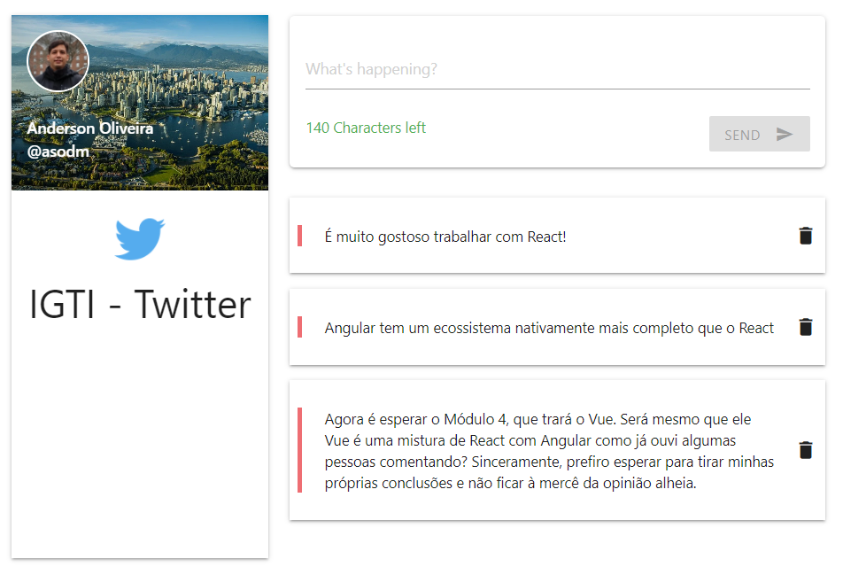

# IGTI - Twitter

This project is the result of an assignment from IGTI Front-end Bootcamp - Module 03 - React.

All of the assignment requests could be readed (in portuguese pt-BR) [here](./assignment.pdf).

The main target of this assignment was to simulate a "Twitter" application that:
* Is completely developed in React;
* Uses preferably Functional Components and Hooks;
* Is able to post new tweets with a 280 maximum characters;
* Has a "Ctrl + Enter" shortcut key to post;
* Has insertions and deletes persisted on backend;
* Uses the [uuid](https://github.com/uuidjs/uuid) and the [axios](https://github.com/axios/axios) libraries;

## Some considerations

I really enjoyed developing this project. As far as you code in React and getting the way to do what you want to do, it becames funny. I also used the [Materialize](https://materializecss.com/) to stylize my pages.

This project have a [JSON-Server](https://github.com/typicode/json-server) backend to persist the posts.

## How to
1. Get the project to your enviroment.
2. Go to to `./backend`folder and execute `$ yarn` to install backend's dependencies.
3. Still on the `./backend` folder and execute `$ yarn start`
...* A Json-Server will starts on the 3001 port.
4. Go to to `./frontend`folder and execute `$ yarn` to install frontend's dependencies.
5. Still on the `./frontend` folder and execute `$ yarn start`
...* The Project will open on your default browser on http://localhost:3000 port

## Assumptions
You should have [Node.js](https://nodejs.org/en/) and [React](http://reactjs.org) installed on your enviroment.

## Screenshot

